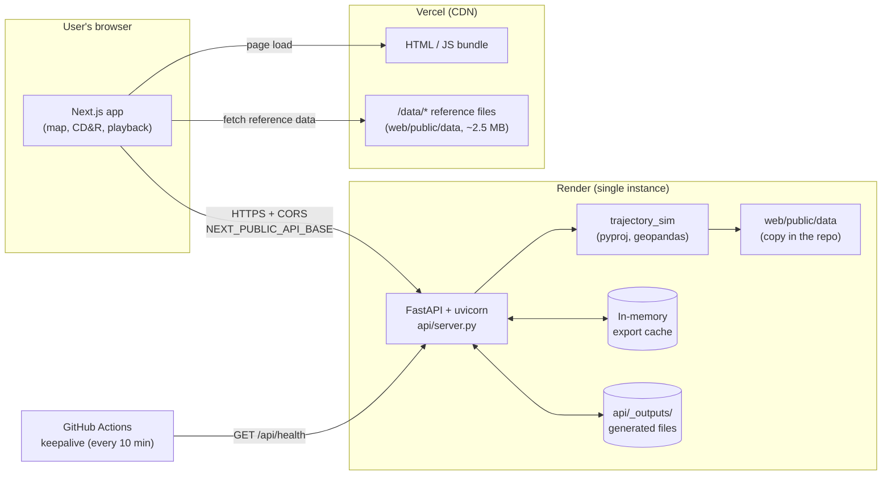
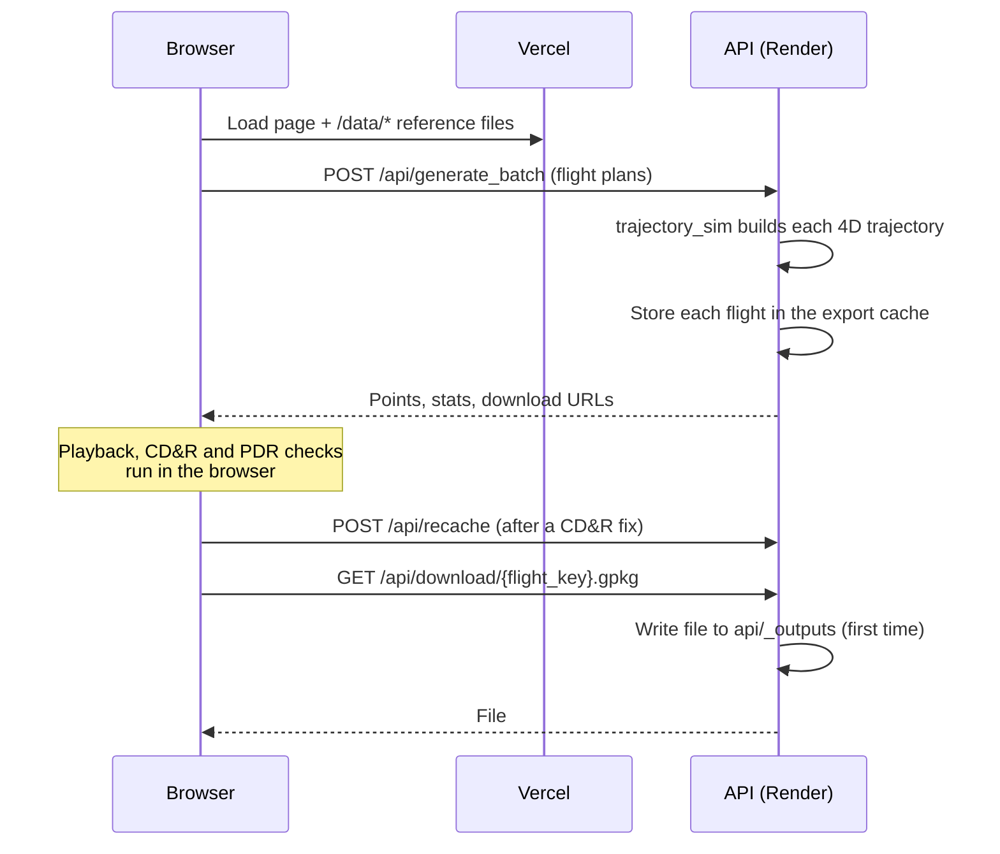

# Deployment Architecture

How TrajX VY is put together once deployed: which parts run where, how they
talk to each other, what state they keep, and what that means for running
them. For the click-by-click setup steps, see [DEPLOY.md](DEPLOY.md).

## At a glance

The system has two deployable parts plus a scheduled job:

| Part | Code | Hosted on (production) | Runs as |
| --- | --- | --- | --- |
| **Web front-end** | `web/` (Next.js 14, React 18, Leaflet) | Vercel | Static pages + JS bundle, served from Vercel's CDN |
| **Trajectory API** | `api/` + `trajectory_sim/` (FastAPI, geopandas, pyproj) | Render (free web service) | One long-running `uvicorn` process |
| **Keep-alive ping** | `.github/workflows/keepalive.yml` | GitHub Actions | Cron job, every 10 minutes |

The same two parts can also run together on one machine with Docker Compose
(see [Other ways to run it](#other-ways-to-run-it)).



### Why it is split in two

The engine depends on native geospatial libraries (`geopandas`, `pyproj`,
`shapely`, `pyogrio`) and keeps a warm, long-running server process with
caches in memory. That doesn't fit Vercel's serverless functions, which have
size and runtime limits and don't keep a process alive. So Vercel serves only
the front-end, and the Python API runs on Render as an ordinary web service.

## The web front-end (Vercel)

- **Build:** Vercel's project root is `web/`, and it runs the `vercel-build`
  script (`next build`). Every page is prerendered as static content (`/` and
  `/report`), so there is no server-side rendering and no Next.js API route in
  production.
- **Where the work happens:** all interactive computation runs in the
  browser. That covers animation playback, conflict detection and resolution
  (CD&R), the PDR/restricted-area check, sector load and airspace membership.
  The server is only called for things the Python engine must do: generating
  trajectories, SID/STAR/approach procedures, and export files.
- **Reference data:** the browser fetches static files straight from the
  front-end's own origin under `/data/…`. These include `aip_VY.json`, the
  airspace, restricted-area, SID/STAR/approach GeoJSON, and the runway and
  airport CSVs. They come from `web/public/data/` and are cached by the CDN.
- **The report page:** `/report` opens in a new tab and gets its data from the
  console tab through `window.opener` / `postMessage`. It needs no server, but
  it only works when opened from the console.
- **Configuration is fixed at build time.** `NEXT_PUBLIC_*` variables are
  inlined into the JavaScript bundle during `next build`, so changing one
  means rebuilding and redeploying.

| Variable | Purpose | Default when unset |
| --- | --- | --- |
| `NEXT_PUBLIC_API_BASE` | URL the browser calls for the API (no trailing slash) | `http://localhost:8000` |
| `NEXT_PUBLIC_CARTO_API_KEY` | Enables the CARTO Dark Matter basemap | Falls back to Esri Dark Gray Canvas (no key needed) |

## The trajectory API (Render)

- **Build and start** (from [`render.yaml`](render.yaml)):
  `pip install -r requirements.txt`, then
  `uvicorn api.server:app --host 0.0.0.0 --port $PORT`, on Python 3.11.9.
  The geospatial packages ship prebuilt manylinux wheels, so no system GDAL is
  installed.
- **Health check:** `GET /api/health` returns `{"ok": true, "aip_present": …,
  "airac": …, "waypoint_count": …}`. Render uses it to decide whether a deploy
  is healthy.
- **Reference data:** the engine reads the **same** `web/public/data/` files
  the browser uses, from its own copy of the repository. The two parts
  therefore need to be deployed from the same commit, or the map and the
  engine can disagree about the navdata. Aircraft performance data lives in
  `trajectory_sim/data/`.

### Main endpoints

| Method | Path | Used for |
| --- | --- | --- |
| GET | `/api/health` | Liveness, data presence, AIRAC cycle |
| POST | `/api/generate`, `/api/generate_batch` | Build trajectories from flight plans |
| GET | `/api/procedures/{airport}` (+ `/{name}`), `/api/suggest-procedure/…`, `/api/approach-entries/…` | SID/STAR/approach data (cached for 1 day) |
| GET | `/api/flight_time_curve` | Distance → flight-time curve for an aircraft type |
| POST | `/api/extend/{flight_key}`, `/api/recache`, `/api/ingest`, `/api/conflict_marks` | Update a flight the server already holds (CD&R fixes, imported tracks, conflict columns) |
| GET/POST | `/api/download/{flight_key}.{gpkg\|csv\|geojson}`, `/api/export_prepare`, `/api/download_zip`, `/api/download_combined` | Export files |

The full request format is in [api/README.md](api/README.md).

### CORS

The browser calls the API from a different origin, so the API allows:

- any `http://localhost:<port>` or `127.0.0.1:<port>` (local development);
- any `https://*.vercel.app` (production and preview deployments);
- extra origins listed in the `WEB_ORIGIN` environment variable
  (comma-separated). Set this when the front-end uses a custom domain.
  `WEB_ORIGIN="*"` allows every origin; that's acceptable here because the API
  uses no cookies or credentials.

### The API keeps state (important)

The API is **not stateless**, and that shapes how it can be hosted:

1. **In-memory export cache.** Each generated flight is kept in memory
   (`_EXPORT_CACHE`, up to 4,000 flights, oldest dropped first) under its
   `flight_key`. Downloads, `extend`, `recache` and `conflict_marks` all look
   the flight up there.
2. **Files on local disk.** Export files are written to `api/_outputs/` the
   first time they are downloaded, and served from there afterwards.
3. **Warm caches.** Navdata and procedures are loaded once per process
   (`lru_cache`).

What follows from this:

- **Run exactly one instance.** With two or more instances behind a load
  balancer, a download could reach an instance that never generated that
  flight, and fail with *404 "File not found — generate it first."* Don't
  scale out, and don't add uvicorn `--workers`, without first moving the cache
  to shared storage (for example Redis plus object storage).
- **A restart forgets every generated flight.** Render's disk is ephemeral
  and the cache lives in memory. After a redeploy, a crash or a free-tier
  sleep, users must press **Generate** again before downloading or applying
  server-side fixes.
- **Memory grows with use.** A cache of thousands of flights with their
  GeoDataFrames can use a lot of RAM. The free Render plan is small, so very
  large traffic days are the likeliest cause of an out-of-memory restart.

## Keep-alive job (GitHub Actions)

Render's free tier stops a service after about 15 minutes without traffic.
The next request then waits 30–60 seconds or more while it starts again. To
avoid that, `.github/workflows/keepalive.yml` calls `/api/health` every 10
minutes. It tries up to 3 times with a long timeout, because the goal is to
wake the service, not to test it.

Two things to keep in mind:

- The URL is hard-coded in the workflow
  (`https://trajectory-api-zf51.onrender.com/api/health`). Update it if the
  Render service is renamed or recreated.
- GitHub pauses scheduled workflows in repositories with no activity for 60
  days.

The keep-alive also protects the in-memory cache: a service that never
sleeps keeps its generated flights.

## Request flow: generating and downloading a flight



## Other ways to run it

### Docker Compose (whole stack on one machine)

```bash
docker compose up --build
# Web → http://localhost:3000   API → http://localhost:8000/api/health
```

- **`api` image** ([api/Dockerfile](api/Dockerfile)): `python:3.11-slim`,
  built from the repo root. It copies only `requirements.txt`,
  `trajectory_sim/`, `api/` and `web/public/data/`; the root `.dockerignore`
  excludes everything else. It has its own health check.
- **`web` image** ([web/Dockerfile](web/Dockerfile)): a multi-stage
  `node:20-alpine` build producing a Next.js **standalone** server
  (`NEXT_STANDALONE=1`), run as the unprivileged `node` user.
- **`web` waits for `api`** to report healthy before starting.
- **Generated files persist:** they are kept in the `api_outputs` Docker
  volume, so they survive container restarts. The in-memory cache does not.
- **`NEXT_PUBLIC_API_BASE` is a build argument,** and it must be a URL
  **the user's browser** can reach (`http://localhost:8000` by default), not
  the Docker-internal name `http://api:8000`. The browser, not the web
  container, makes the API calls.

### Local development

```bash
cd web
npm run dev        # creates .venv and installs deps on first run, then starts API :8000 + web :3000
```

`scripts/dev.mjs` sets up the Python virtualenv and `node_modules` if they're
missing, then runs both processes. Use Python 3.11–3.13; the pinned
geospatial packages have no wheels for 3.14 yet.

For realistic performance, test with the production build (`npm run build`,
then `npm start`) rather than the dev server. See
[web/PERFORMANCE.md](web/PERFORMANCE.md).

## Releasing a change

1. Push to the GitHub repository (`Supapich6511794/TrajX_VY`).
2. Vercel rebuilds the front-end, and Render rebuilds the API, from the pushed
   commit. Both are connected to the repository.
3. After a Render deploy, the in-memory cache is empty. Anyone with the app
   open must generate again before downloading.
4. For a new AIRAC cycle, regenerate the files under `web/public/data/` (see
   [DATA_SOURCES.md](DATA_SOURCES.md)) and deploy **both** parts, since each
   one reads them.

No CI job runs the tests before deployment; the only GitHub workflow is the
keep-alive ping. Run them locally before pushing:

```bash
cd web && npx vitest run          # front-end
cd .. && pytest                   # engine + API
```

## Limits and next steps

| Limit today | Effect | Possible fix |
| --- | --- | --- |
| API state lives in one process | Can't run more than one instance; a restart loses generated flights | Move the export cache to Redis and files to object storage (e.g. S3) |
| Free-tier Render sleeps | Cold starts of 30–60 s or more; relies on the keep-alive job | Paid always-on instance |
| Small free-tier memory | Very large traffic days can exhaust RAM | Bigger instance, or cache eviction by size rather than count |
| Keep-alive URL is hard-coded | Silently stops working if the service URL changes | Read it from a repository variable |
| No CI tests | A broken commit deploys straight to production | Add a GitHub Actions job running `vitest` and `pytest` on each push |
| Reference data is duplicated between both deploys | Web and API can drift if deployed from different commits | Deploy both from the same commit (already the default when both auto-deploy) |
